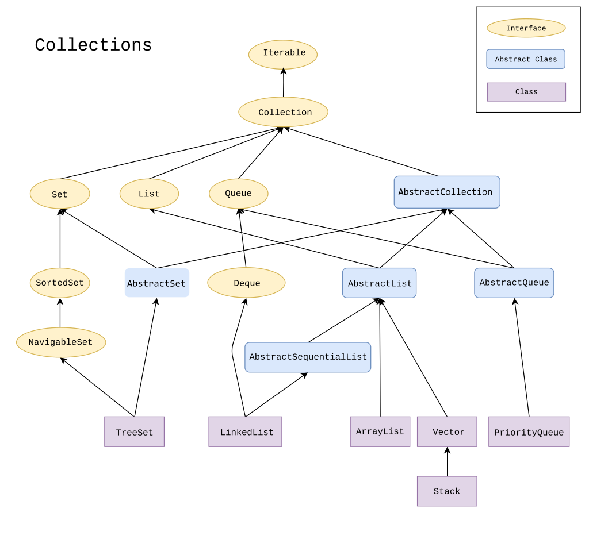

## JAVA COLLECTIONS FRAMEWORK :
    The Collection in Java is a framework that provides an architecture to store
    and manipulate the group of objects.

    Java Collections can achieve all the operations that you perform on a data
    such as searching, sorting, insertion, manipulation, and deletion.
    

#### # Collection class is available in java.util package

Collections Examples:

    1. ArrayList
    2. Set
    3. Stack
    4. HashMap

#### Collection Hierarchy

